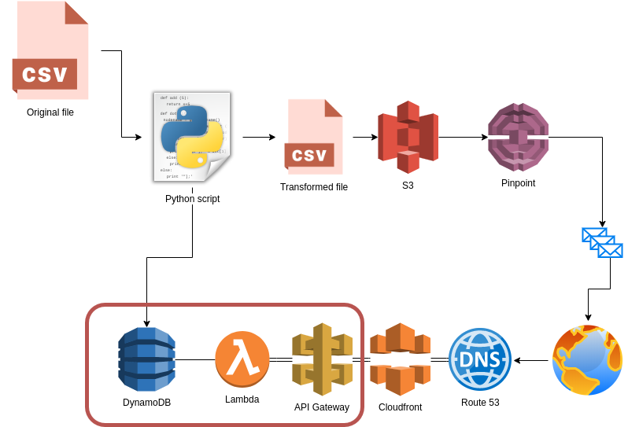

# aws-pinpoint-unsubscribe

A simple serverless API for handling unsubscribes with AWS Pinpoint.

## What this does

AWS Pinpoint is a bulk email sending service, which means it incorporates common ESS
features like click and open tracking, A/B testing, mail merge, and so on. Notably
absent from Pinpoint (at the time this repo was created) is any built-in mechanism
for handling unsubscribes. This utility is meant to solve that.

This creates a very simple serverless API to allow users to unsubscribe from your email
campaigns and thus stay in compliance with the law.



The API design is simple: there is a table created in DynamoDB which stores a copy of
your list, indexed by a proprietary hash of the endpoint (aka email address). When a
user clicks the unique unsubscribe link sent in the message, it fires a Lambda (via 
API Gateway) which updates the record in Dynamo to mark it as unsubscribed, and then
serves a simple HTML page. The "core API" is shown above in the red box.

There is also a Python script includes which ties everything together and is meant to
be run when first setting this up. The script imports your list of contacts into
Pinpoint (along with the unique hash which is generated), while simultaneously
populating the Dynamo data store.

Cost was a major factor in the design of this system, hence why I chose Lambda and Dynamo.
Under average use, it is very likely you won't see any cost added to your monthly AWS spend
at all with this API. Realistically the only costs you'll incur is whatever you spend on
your Pinpoint campaign - not on this API.

## Installation

Run the Terraform scripts first. This will print various outputs that you will need
to feed into the Python script. If you want to reference a profile name, then be sure
to update both the `terraform/main.tf` and `importer/aws.py` files first.

Once the Terraform has been run, install the pip dependencies specified in requirements.txt
to your virtual environment (e.g. `pip install -r requirements.txt`). Then invoke the Python
script with the following arguments and required options:

```bash
./main.py PATH_TO_YOUR_CSV_FILE.csv
    --app-id PINPOINT_APPLICATION_ID
    --dynamo-table DYNAMO_TABLE_NAME
    --role-arn PINPOINT_IAM_ROLE
    --segment-name SEGMENT_NAME_OF_YOUR_CHOOSING
    --s3-bucket S3_BUCKET_NAME
```

The Pinpoint Application ID, Dynamo Table name, IAM role name, and S3 bucket name will
all appear as outputs from the Terraform. You must choose your own segment name, and
naturally you must provide a CSV file to import.

## CSV File Input Format

The CSV file you provide must include at least this one header:

* Email

The code is currently set up to also support the following, optional headers:

* First Name
* Middle Name
* Last Name

Feel free to fork this project and add in code to handle additional attributes
if you want to.

## Using the unsubscribe link in Pinpoint campaigns

When you actually need to send your campaign, include a link like this in the Message Template:

```html
<a href="https://1234567890.execute-api.us-east-1.amazonaws.com/unsubscribe/{{User.UserId}}">unsubscribe</a>
```

Of course you need to replace the 1234567890 portion with your actual API Gateway URL.
This will be displayed as one of the Terraform outputs.

## Extra credit

If you don't want such an ugly URL for your unsubscribe link, you can add a Cloudfront distribution in
front of your API Gateway, assign it a certificate from ACM, enable HTTP to HTTPS forwarding, and set
up a CNAME record in Route53 to point to the CF distribution. I didn't try to codify this part in
Terraform (yet) because it's dependent on your domain name and certificate. It doesn't really matter
that much though, since AWS is going to prepend your link with `awstrack.me` (so it will look ugly
to the user no matter what).
